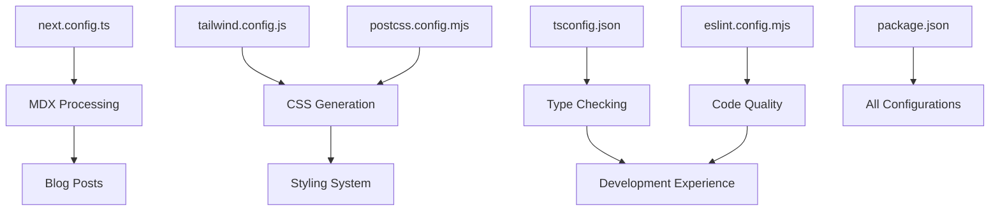

# Configuration Reference

This document explains all configuration files and their purpose in the Next.js application.

## Configuration Files Overview

| File | Purpose | Status |
|------|---------|--------|
| `tailwind.config.js` | Tailwind CSS configuration | ✅ Fully utilized |
| `postcss.config.mjs` | PostCSS processing | ✅ Essential for Tailwind v4 |
| `next.config.ts` | Next.js configuration | ✅ Required for MDX |
| `tsconfig.json` | TypeScript configuration | ✅ Standard Next.js setup |
| `eslint.config.mjs` | ESLint configuration | ✅ Next.js + TypeScript rules |
| `package.json` | Dependencies and scripts | ✅ All dependencies used |

## Detailed Configurations

### 1. tailwind.config.js

**Purpose**: Configures Tailwind CSS behavior, content paths, theme extensions, and plugins.

```javascript
module.exports = {
  content: [
    './src/pages/**/*.{js,ts,jsx,tsx,mdx}',    // Pages (App Router)
    './src/components/**/*.{js,ts,jsx,tsx,mdx}', // Components
    './src/app/**/*.{js,ts,jsx,tsx,mdx}',      // App Router files
    './src/content/**/*.{md,mdx}',             // MDX blog content
  ],
  darkMode: 'class',                           // Class-based dark mode
  theme: {
    extend: {
      fontFamily: {                            // Custom font integration
        sans: ['var(--font-geist-sans)'],
        mono: ['var(--font-geist-mono)'],
      },
      typography: { /* ... */ }                // @tailwindcss/typography customization
    },
  },
  plugins: [
    require('@tailwindcss/typography'),        // Blog post styling
  ],
}
```

**Key Features**:
- ✅ **Content paths**: All scan paths contain Tailwind classes
- ✅ **Dark mode**: `'class'` enables manual toggle + system preference
- ✅ **Font family**: Integrates with Next.js font loading
- ✅ **Typography plugin**: Extensive prose styling for blog posts
- ✅ **Custom typography**: Light/dark mode prose variants

### 2. postcss.config.mjs

**Purpose**: Configures PostCSS to process Tailwind CSS v4.

```javascript
const config = {
  plugins: ["@tailwindcss/postcss"],
};
```

**Why It's Needed**:
- Tailwind v4 requires the new PostCSS plugin
- Processes `@import "tailwindcss"` directive
- Handles `@theme inline` syntax
- Essential for build process

### 3. next.config.ts

**Purpose**: Configures Next.js with MDX support for blog functionality.

```typescript
const nextConfig: NextConfig = {
  pageExtensions: ['js', 'jsx', 'md', 'mdx', 'ts', 'tsx'],
};

const withMDX = createMDX({
  options: {
    remarkPlugins: [remarkGfm],      // GitHub Flavored Markdown
    rehypePlugins: [rehypeHighlight], // Code syntax highlighting
  },
});
```

**Key Features**:
- ✅ **MDX integration**: Enables `.mdx` files as pages/components
- ✅ **GitHub Flavored Markdown**: Tables, strikethrough, task lists
- ✅ **Syntax highlighting**: Code blocks with language support
- ✅ **Page extensions**: Supports multiple file types

### 4. tsconfig.json

**Purpose**: TypeScript configuration for Next.js project.

```json
{
  "compilerOptions": {
    "target": "ES2017",
    "lib": ["dom", "dom.iterable", "esnext"],
    "strict": true,
    "paths": {
      "@/*": ["./src/*"]                       // Path alias for imports
    },
    "plugins": [{ "name": "next" }]            // Next.js TypeScript plugin
  },
  "include": ["next-env.d.ts", "**/*.ts", "**/*.tsx", ".next/types/**/*.ts"]
}
```

**Key Features**:
- ✅ **Strict mode**: Enabled for better type safety
- ✅ **Path aliases**: `@/*` maps to `./src/*`
- ✅ **Next.js plugin**: Provides Next.js-specific TypeScript features
- ✅ **Modern target**: ES2017 for good browser support

### 5. eslint.config.mjs

**Purpose**: ESLint configuration for code quality and Next.js best practices.

```javascript
const eslintConfig = [
  ...compat.extends("next/core-web-vitals", "next/typescript"),
];
```

**Key Features**:
- ✅ **Next.js rules**: Core web vitals and performance rules
- ✅ **TypeScript support**: TypeScript-specific linting
- ✅ **Modern config**: Uses flat config format (ESLint 9+)

### 6. package.json

**Purpose**: Defines project dependencies, scripts, and metadata.

#### Scripts
- `npm run dev`: Development server with Turbopack
- `npm run build`: Production build
- `npm start`: Production server
- `npm run lint`: ESLint checking

#### Key Dependencies
```json
{
  "dependencies": {
    "next": "15.3.2",                          // Next.js framework
    "@tailwindcss/typography": "^0.5.16",      // Blog post styling
    "gray-matter": "^4.0.3",                  // MDX frontmatter parsing
    "next-mdx-remote": "^5.0.0",              // Dynamic MDX rendering
    "rehype-highlight": "^7.0.2",             // Code syntax highlighting
    "remark-gfm": "^4.0.1"                    // GitHub Flavored Markdown
  },
  "devDependencies": {
    "@tailwindcss/postcss": "^4",             // Tailwind v4 PostCSS
    "tailwindcss": "^4",                      // Tailwind CSS v4
    "typescript": "^5",                       // TypeScript support
    "eslint-config-next": "15.3.2"           // Next.js ESLint rules
  }
}
```

**Dependency Analysis**:
- ✅ **All dependencies used**: No unused packages found
- ✅ **Version alignment**: Next.js and related packages are version-matched
- ✅ **Development vs production**: Proper separation of concerns

## Configuration Relationships



## Why Each Configuration Is Necessary

### Tailwind Config
- **Content paths**: Ensures proper CSS purging
- **Dark mode**: Enables theme switching functionality
- **Typography**: Required for blog post formatting
- **Font integration**: Connects Next.js fonts with Tailwind

### PostCSS Config  
- **Tailwind v4**: New architecture requires PostCSS plugin
- **Build process**: Essential for CSS processing
- **Performance**: Handles optimization and purging

### Next.js Config
- **MDX support**: Blog functionality depends on it
- **File extensions**: Enables `.mdx` as valid pages
- **Plugin ecosystem**: Integrates remark/rehype plugins

### TypeScript Config
- **Path aliases**: Improves import statements (`@/components`)
- **Next.js integration**: Provides framework-specific types
- **Strict mode**: Catches potential runtime errors

### ESLint Config
- **Code quality**: Maintains consistent code style
- **Next.js specific**: Catches framework-specific issues
- **Performance**: Web vitals and optimization rules

## Maintenance Notes

### When to Update
1. **Tailwind config**: When adding new components or design tokens
2. **Next.js config**: When adding new MDX plugins or features
3. **Package.json**: Regular dependency updates
4. **TypeScript config**: When changing project structure

### Configuration Dependencies
- Tailwind config → PostCSS config (processing)
- Next.js config → Package.json (MDX dependencies)
- ESLint config → TypeScript config (type-aware rules)

This configuration setup provides:
- ✅ Modern development experience
- ✅ Optimized production builds  
- ✅ Type safety and code quality
- ✅ Blog functionality with MDX
- ✅ Responsive design system